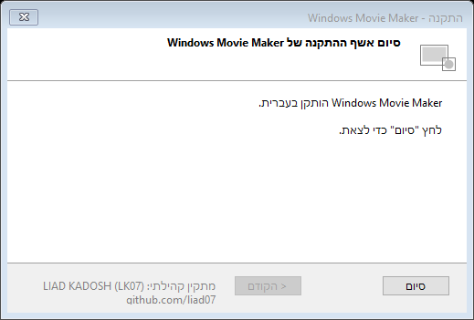
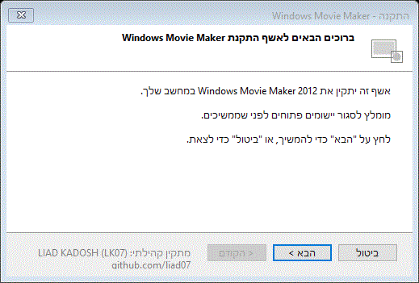
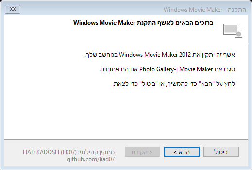
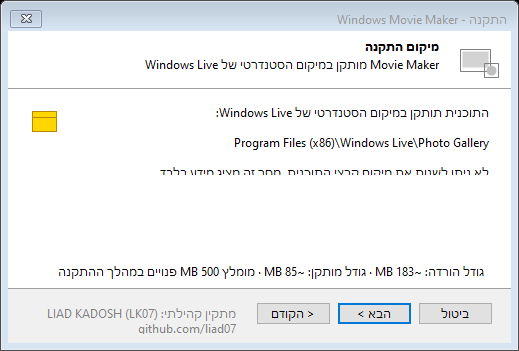
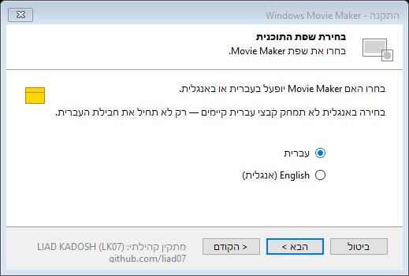
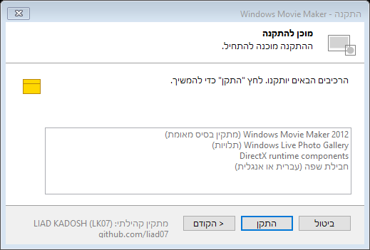
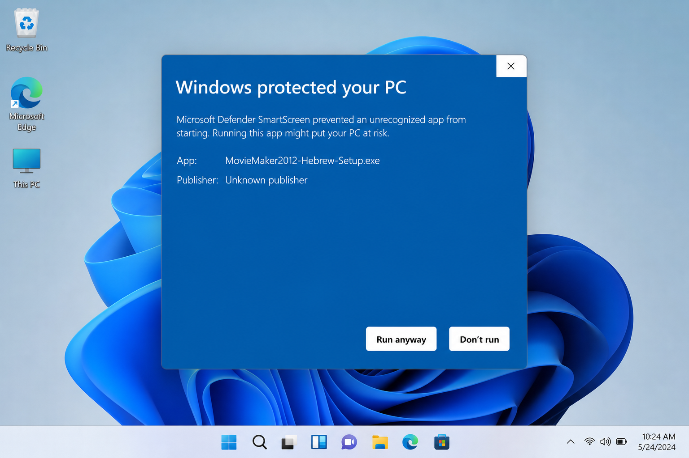

# Windows Movie Maker 2012 Community Installer
### v1.1.0 · Hebrew and English Setup for Modern Windows

**COMMUNITY INSTALLER BY LIAD KADOSH · LK07**  
[github.com/liad07](https://github.com/liad07)

> **עברית:** מתקין קהילתי מאוחד ל־Windows Movie Maker 2012 — התקנה בעברית או באנגלית עבור Windows 10 ו־Windows 11, בלי העתקות ידניות.

---

## התקנה מהירה (עברית)

1. הורד `MovieMaker2012-Hebrew-Setup.exe` מ-[Releases](https://github.com/liad07/movie-maker-2012-hebrew-installer/releases)
2. אמת SHA-256 (ראו למטה)
3. הרץ **כמנהל מערכת** (Run as Administrator)
4. אם מופיע SmartScreen — **More info → Run anyway** (הקובץ לא חתום; ראו [SmartScreen Notice](#smartscreen-notice))
5. עקוב אחרי האשף בעברית ובחר שפת תוכנית (עברית / אנגלית)

### תצוגה מקדימה





| שלב | צילום מסך |
|-----|-----------|
| ברוכים הבאים |  |
| בחירת תיקייה |  |
| בחירת שפה |  |
| מוכן להתקנה |  |
| SmartScreen |  |

### אימות SHA-256 (PowerShell)

```powershell
Get-FileHash .\MovieMaker2012-Hebrew-Setup.exe -Algorithm SHA256
```

השווה לערך בקובץ `MovieMaker2012-Hebrew-Setup.sha256` שמגיע עם ה-release.

### אימות SHA-256 (certutil)

```cmd
certutil -hashfile MovieMaker2012-Hebrew-Setup.exe SHA256
```

### יומן התקנה

במקרה של כשל: `%TEMP%\MovieMaker2012-Hebrew-Setup.log`

---

## Overview

A community-maintained installer wrapper that restores **Windows Movie Maker 2012** on modern Windows with a **Hebrew setup wizard** and automatic **Hebrew or English** UI configuration for Movie Maker itself.

This project is **not affiliated with Microsoft**.

---

## The Problem

Microsoft discontinued Windows Movie Maker in 2017. Since then, Hebrew-speaking users often had to:

| Issue | Impact |
|-------|--------|
| Use archived offline installers | No official Microsoft download |
| Install in English first | No built-in Hebrew setup path |
| Manually copy `.mui` folders | Error-prone and confusing |
| Follow video guides | Fragile, unprofessional experience |
| Mix EXE + folders + scripts | Not a unified installer |

---

## Our Solution

This project provides a **single community installer** that:

1. Shows a **Hebrew setup wizard** (RTL)
2. Lets the user choose **Hebrew or English** for Movie Maker
3. Runs the legacy base installer silently via PowerShell
4. Automatically deploys the selected language pack
5. Writes an installation log to `%TEMP%\MovieMaker2012-Hebrew-Setup.log`
6. Cleans up temporary extracted payload files after setup

```
┌──────────────────┐    ┌─────────────────────┐    ┌────────────────────────┐
│ Community Wizard │ → │ Legacy base install  │ → │ Language pack deployment│
│  (WinForms, HE)  │    │ (user-provided EXE) │    │ he/ folders → Windows Live│
└──────────────────┘    └─────────────────────┘    └────────────────────────┘
```

---

## Features

- Single release EXE for end users (~183 MB download, self-contained)
- Hebrew setup wizard with RTL layout and live install status
- Hebrew / English Movie Maker language selection (English does not delete existing `he` folders)
- Verified single base installer with mandatory SHA-256 at build time
- Localization backup under `%ProgramData%` with restore script
- Automatic rollback if localization fails
- Post-install validation of all 19 Hebrew `.mui` files
- Process guard (blocks install while Movie Maker is open)
- SHA-256 release verification support
- Unified install engine (PowerShell only; C# UI wrapper)
- Session-based logging with Windows version and installer version
- Clear legal separation from Microsoft binaries

---

## Size guidance

| Metric | Approximate value |
|--------|-------------------|
| Download size | ~183 MB |
| Installed Movie Maker footprint | ~85 MB |
| Recommended free space during setup | 500 MB |

---

## Known limitations

- Movie Maker installs to the standard Windows Live location; the wizard does not support custom program folders.
- Only one verified base installer is supported: `Movie Maker 2012.exe` with a matching `vendor/installer.sha256`.
- English mode skips Hebrew deployment but does not remove existing Hebrew folders created earlier.
- The release EXE is unsigned; SmartScreen may warn until code signing is added.
- Full CI cannot rebuild the complete release without a legally supplied Microsoft base installer.

---

## Compatibility

| OS | Status |
|----|--------|
| Windows 11 64-bit | Tested |
| Windows 10 64-bit | Tested |
| Windows 8.1 | Not tested |
| Windows 7 | Experimental |

Requires **Administrator** privileges. Close Movie Maker and Photo Gallery before installing.

---

## FAQ

**Why is Photo Gallery installed?**  
Movie Maker 2012 depends on Windows Live Photo Gallery shared components.

**Can I choose a custom install folder?**  
No. Movie Maker is deployed under the standard Windows Live path.

**How do I restore files overwritten by Hebrew install?**  
Run `scripts\Restore-LocalizationBackup.ps1` as Administrator. Backups live under `%ProgramData%\MovieMaker2012CommunityInstaller\backups\`.

**Why is the download ~183 MB but installed size ~85 MB?**  
The download bundles .NET 8 runtime, the legacy base installer, and Hebrew localization resources.

---

## SmartScreen Notice

Because the release EXE is currently **not code-signed**, Windows SmartScreen may show an **Unknown publisher** warning.

This is expected for unsigned community tools that request administrator access. Verify the SHA-256 hash from the release notes before running.

---

## Quick Start (English)

### End users

1. Download `MovieMaker2012-Hebrew-Setup.exe` from [Releases](https://github.com/liad07/movie-maker-2012-hebrew-installer/releases)
2. Verify SHA-256 using `MovieMaker2012-Hebrew-Setup.sha256`
3. Run as Administrator
4. Complete the wizard (Welcome → Location → Language → Install → Finish)

### Developers

**Prerequisites:** .NET SDK 8+ and PowerShell 5.1+

```powershell
git clone https://github.com/liad07/movie-maker-2012-hebrew-installer.git
cd movie-maker-2012-hebrew-installer

# Place vendor\Movie Maker 2012.exe and vendor\installer.sha256

powershell -ExecutionPolicy Bypass -File installer\Build-HebrewSetup.ps1
```

Output:

```text
dist\MovieMaker2012-Hebrew-Setup.exe
dist\MovieMaker2012-Hebrew-Setup.sha256
```

Alternative (dev, no wizard):

```bat
Install-Hebrew.bat
```

### Automation (maintainers)

```powershell
# Full release + screenshots + GIF + hash verification
powershell -ExecutionPolicy Bypass -File scripts\Build-All.ps1

# Screenshots and GIF only
powershell -ExecutionPolicy Bypass -File scripts\Capture-WizardScreenshots.ps1

# Restore latest localization backup
powershell -ExecutionPolicy Bypass -File scripts\Restore-LocalizationBackup.ps1

# Print SHA-256 of built release EXE
.\dist\MovieMaker2012-Hebrew-Setup.exe --print-hash
```

---

## Installation Flow

| Step | Screen | What happens |
|------|--------|--------------|
| 1 | Welcome | Introduction, process check, existing-install prompt |
| 2 | Install location | Informational standard Windows Live path |
| 3 | Select Program Language | Hebrew or English |
| 4 | Ready to Install | Summary of bundled components |
| 5 | Installing | Verified base install + localization + validation |
| 6 | Finish | Done |

### Important behavior notes

- **Install location** is informational. Movie Maker runtime files are deployed under `Program Files (x86)\Windows Live`.
- Temporary payload files are removed after the wizard closes.
- Localization backups are stored under `%ProgramData%\MovieMaker2012CommunityInstaller\backups\`.
- The wizard does **not** expose fake per-component toggles.

---

## Project Structure

```text
movie-maker-2012-hebrew-installer/
├── README.md
├── CHANGELOG.md
├── LICENSE
├── SECURITY.md
├── THIRD_PARTY_NOTICES.md
├── assets/localization/
├── vendor/
├── installer/
│   ├── Build-HebrewSetup.ps1
│   ├── VendorInstaller.ps1
│   ├── HebrewMovieMakerInstaller.ps1
│   └── SetupLauncher/
├── scripts/
│   ├── Build-All.ps1
│   └── Capture-WizardScreenshots.ps1
├── docs/
│   ├── wizard-demo.gif
│   └── screenshots/
├── .github/workflows/
└── dist/
```

---

## Build Integrity

Optional base-installer validation:

```powershell
(Get-FileHash "vendor\Movie Maker 2012.exe" -Algorithm SHA256).Hash | Set-Content vendor\installer.sha256
```

If `vendor/installer.sha256` exists, the build fails on mismatch.

Each release should publish:

```text
MovieMaker2012-Hebrew-Setup.exe
MovieMaker2012-Hebrew-Setup.sha256
```

---

## Troubleshooting

| Problem | What to try |
|---------|-------------|
| SmartScreen warning | Verify SHA-256, click **More info → Run anyway** |
| Access denied | Run as Administrator |
| Movie Maker still in English | Re-run installer and choose Hebrew |
| Setup failed | Open `%TEMP%\MovieMaker2012-Hebrew-Setup.log` |
| Already installed | Choose **Yes** to reapply the selected language configuration |
| Restore Hebrew backup | `scripts\Restore-LocalizationBackup.ps1` |
| UAC cancelled | Re-launch the installer and approve elevation |

---

## Legal Notice

- The **installer wrapper and scripts** in this repository are licensed under MIT.
- **Microsoft Windows Movie Maker**, Windows Live components, and related binaries remain the property of **Microsoft Corporation**.
- This repository does **not** redistribute Microsoft installers in source control.
- Hebrew `.mui` files under `assets/localization/` are deployment resources extracted from legitimate Windows Essentials / Movie Maker installations. See [THIRD_PARTY_NOTICES.md](THIRD_PARTY_NOTICES.md).

---

## Author

**Liad Kadosh (LK07)**  
GitHub: [github.com/liad07](https://github.com/liad07)

---

## License

MIT for community wrapper code — see [LICENSE](LICENSE)
